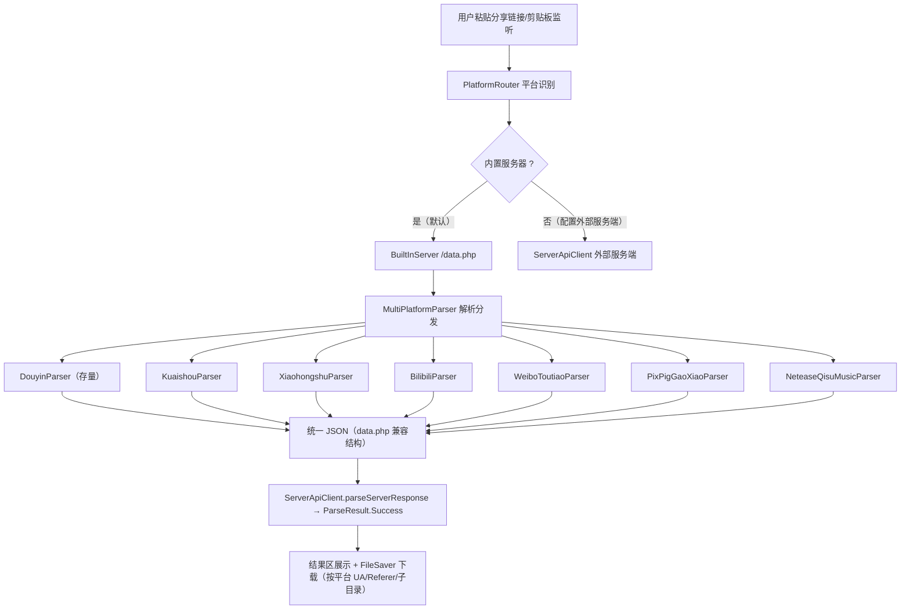

# 多平台解析支持（multi-platform-parse）

Feature Name: multi-platform-parse
Updated: 2026-09-14

## Description

将 dyparse 从"仅抖音解析"扩展为"多平台短视频/图集/音乐解析"工具。用户粘贴任一受支持平台的分享链接，App 自动识别平台并本地解析出无水印直链/图集/实况/音频。全部能力内置本地（内置服务器 + 本地引擎），外部 PHP 服务端保留为可选增强。支持平台：抖音（存量）、快手、小红书、bilibili、微博、今日头条、皮皮虾、皮皮搞笑、汽水音乐、网易云音乐。

## Architecture



**扩展点说明**：现有 `ParseResult.Success` 数据模型已平台无关（author/title/type/play_url/images/gallery_media/quality_list），因此服务端响应映射 `ServerApiClient.parseServerResponse` 无需改动即可承载所有平台；新增平台只需提供一个"输入链接/ID → 统一 JSON"的解析器并在 `PlatformRouter` 注册。

## Components and Interfaces

### 新增组件

| 组件 | 职责 | 关键接口 |
| --- | --- | --- |
| `Platform`（枚举） | 平台定义 + 域名/ID 匹配 | `Platform.detect(input: String): Platform?` |
| `PlatformParser`（接口） | 平台解析器抽象 | `suspend fun parse(input: String, useCookie: Boolean, original: Boolean, highest: Boolean): String`（返回 data.php 兼容 JSON） |
| `MultiPlatformParser` | 按 Platform 分发给具体解析器，聚合异常 | `fun parserFor(platform: Platform): PlatformParser` |
| `BuiltInParser` | 抖音存量实现（已有），改为实现 PlatformParser 接口 | 复用现逻辑 |
| 各平台解析器 | 快手/小红书/bilibili/微博/头条/皮皮虾/皮皮搞笑/汽水/网易云 | 实现 PlatformParser |

### 改动组件

| 组件 | 改动点 |
| --- | --- |
| `BuiltInServer.handleData` | url 先经 `Platform.detect` 识别，再送 `MultiPlatformParser`，不硬编码 `parser?.parse` |
| `LocalParseEngine`（未配置服务端时的 WebView 通道） | 仅保留抖音 detail 链路；多平台统一走内置解析器（见集成决策） |
| `ClipboardShareContent`（ClipboardMonitorPreferences.kt） | 域名识别从 `douyin.com` 扩展为所有受支持平台域名（`isSupportedShare` / `extractParseInput`） |
| `ParserViewModel.parse` | 平台校验从 `contains("douyin")` 改为 `Platform.detect != null`（Line 297 区域），批次作者的 douyin 校验保留 |
| `DouyinVideoDownloadResolver.buildDownloadHeaders` | 按目标 CDN 域名给默认 UA/Referer（新平台各自提供下载 UA/Referer） |
| `FileSaver` | 保存按平台子目录（如 `dyparse/kuaishou/`），文件名带平台前缀 |
| `ParseResult.Success.type` | 扩展取值 `music`（音乐平台），UI 与保存链路适配 |
| `server/data.php` | 可选：增加非抖音平台的转发/解析（外部服务端增强，非本轮硬性要求） |

## Data Models

各平台解析器统一返回与 `server/data.php` 兼容的 JSON（字段与 `BuiltInParser.buildSuccessJson` 对齐）：

```json
{
  "success": true,
  "author": "作者", "author_uid": "...", "author_sec_uid": "...",
  "title": "标题", "video_id": "平台作品ID", "timestamp": 0,
  "type": "video" | "image" | "music",
  "play_url": "无水印视频/音频直链", "raw_play_url": "原始地址",
  "cover": "封面URL",
  "images": ["图1","图2"] | null,
  "gallery_media": [{"index":0,"image_url":"...","live_photo_raw_url":null}],
  "duration": 0.0,
  "quality_list": [{"label":"原画质","ratio":"default","url":"...","size_bytes":null}],
  "original_play_url": "保存用地址", "resolved_url": "跟随重定向后的地址",
  "input_url": "用户输入", "source": "builtin-multi"
}
```

`Platform` 枚举定义（含域名匹配规则）：

| 平台 | 匹配域名/特征 | 作品ID规则 |
| --- | --- | --- |
| DOUYIN | `douyin.com` / `iesdouyin.com` / 19位纯数字 | `/(video|note)/(\d{15,21})` |
| KUAISHOU | `kuaishou.com` / `kwai.com` | 分享页 JSON `itemId` |
| XIAOHONGSHU | `xiaohongshu.com` / `xhslink.com` | `/explore/\w+` / `/discovery/item/\w+` |
| BILIBILI | `bilibili.com` / `b23.tv` | `/(BV\w+|av\d+)/` |
| WEIBO | `weibo.com` / `weibo.cn` | 分享页 HTML 直链 |
| TOUTIAO | `toutiao.com` / `toutiaovideo.com` | `group_id` |
| PIXPIG（皮皮虾） | `pipix.com` | 分享页 JSON |
| PIGAO（皮皮搞笑） | `pearvideo.com`-like 或自有 | 分享页 JSON |
| QISHU（汽水音乐） | `qishu` 相关 | 歌曲 ID |
| NETEASE（网易云音乐） | `163cn.tv` / `music.163.com` | `/song\?id=\d+` |

## Correctness Properties

1. 内置服务器对任一台平台返回结构均与 `data.php` 兼容，客户端 `ServerApiClient` 无感知。
2. 抖音存量链路（内置服务器/本地 WebView/外部服务端/批量/历史/图集实况/画质）行为不变（REQ-8）。
3. 未知域名输入返回明确 `success=false + 平台不支持` 错误，不误伤校验。
4. 平台 `type=music` 结果不得在视频 UI 路径抛空（结果区按 type 分支）。
5. 下载以目标 CDN 域名选择 UA/Referer，避免 403（REQ-7）。

## Error Handling

| 场景 | 处理 |
| --- | --- |
| 平台无法识别 | 返回「无法识别平台/不支持该平台」，并在错误文案中列出支持平台 |
| 平台解析器失败 | 返回 `success=false,error=<原因>`；单条内置失败时若疑似图集走本地 WebView 回退（仅抖音） |
| 音乐平台无播放地址 | 返回明确「音频地址获取失败」 |
| 网络/超时/风控 | 透出 HTTP/异常信息，与存量行为一致 |
| 外部服务端已配置 | 优先外部，内置仅兜底（REQ-4） |

## Test Strategy

- 单元测试：`Platform.detect`（各平台链接/ID/文案→平台），覆盖正反向用例。
- 单元测试：`MultiPlatformParser` 平台→解析器映射、未知平台错误 JSON。
- 单元测试：bilibili `BV/av` 提取、网易云 `song id` 提取、快手分享页 URL 归一化。
- 集成：`assembleDebug` 通过 + 现有单测（BatchAuthorMatcherTest 等）不回归。
- 真机：从各平台 App 复制真实分享链接逐平台验证（后续用户验证项）。

## References

[^1]: (Website) - [jiuhunwl/short_videos（参考平台清单与解析思路）](https://github.com/jiuhunwl/short_videos)
[^2]: (app/src/main/java/Forinxy/jiexi/ParserViewModel.kt#L297) - 单条解析平台校验（当前 `contains("douyin")`，将改为 Platform 识别
[^3]: (app/src/main/java/Forinxy/jiexi/builtin/BuiltInParser.kt#L126) - 内置抖音解析主入口，作为 PlatformParser 接口改造基线
[^4]: (app/src/main/java/Forinxy/jiexi/builtin/BuiltInServer.kt#L170) - 内置服务器路由 /data.php，将改为按平台分发
[^5]: (app/src/main/java/Forinxy/jiexi/ClipboardMonitorPreferences.kt#L30) - 剪贴板共享内容域名识别，需扩展多平台
[^6]: (app/src/main/java/Forinxy/jiexi/ServerApiClient.kt#L99) - 统一响应解析（平台无关，无需改动）
[^7]: (app/src/main/java/Forinxy/jiexi/data/ParseResult.kt#L34) - 数据模型 type 字段将扩展 music